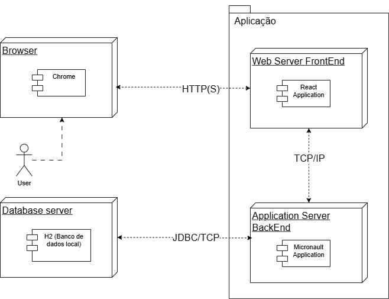

<div align="center">


<br/>


</div>


> **Nome Do Projeto:** Ciel cars -
> **Disciplina:** Laboratório de Desenvolvimento de Software - 
> **Curso:** Engenharia de Software — 4º Período - 
> **Professor:** João Paulo Carneiro Aramuni 

---

##  🧾 Sobre o Projeto

Sistema web de aluguel de carros desenvolvido como atividade prática da disciplina de Laboratório de Desenvolvimento de Software da PUC Minas. O projeto incial **MVP** preve que plataforma permite que clientes criem e cancelem pedidos de aluguel, enquanto agentes (empresas ou bancos) avaliam financeiramente esses pedidos e aprovam ou reprovam os contratos.

---

##  ⚙️Tecnologias

| Camada | Tecnologia |
|--------|-----------|
| Frontend | React + Vite |
| Backend | Java + Micronaut |
| Banco de Dados | H2 (H2 Database é um banco de dados SQL feito para aplicações Java. Ele é muito usado em desenvolvimento e testes.) |
| Build | Gradle |

---

##  🚀 Como Executar

### Backend

```bash
cd Sistema-aluguel-de-carros/backend
./gradlew run
```

Servidor disponível em: `http://localhost:8080`

### Frontend

```bash
cd Sistema-aluguel-de-carros/frontend
npm run dev
```

Interface disponível em: `http://localhost:5173`

---

##  🔌 API e Atores

<details>
<summary><strong> Endpoints da API</strong></summary>

### Auth
| Método | Rota | Descrição |
|--------|------|-----------|
| POST | `/auth/login` | Autentica um usuário e retorna dados de sessão |

### Usuários
| Método | Rota | Descrição |
|--------|------|-----------|
| POST | `/usuarios` | Cadastra um novo usuário |
| GET | `/usuarios` | Lista todos os usuários |
| GET | `/usuarios/{id}` | Busca um usuário pelo ID |

### Clientes
| Método | Rota | Descrição |
|--------|------|-----------|
| POST | `/clientes` | Cadastra um novo cliente com endereço e dados pessoais |
| GET | `/clientes` | Lista todos os clientes ativos (suporta filtro `?nome=`) |
| GET | `/clientes/{id}` | Busca um cliente pelo ID |
| PUT | `/clientes/{id}` | Atualiza todos os dados de um cliente |
| DELETE | `/clientes/{id}` | Inativa logicamente um cliente |

### Automóveis
| Método | Rota | Descrição |
|--------|------|-----------|
| POST | `/automoveis` | Cadastra um novo automóvel |
| GET | `/automoveis` | Lista todos os automóveis |
| GET | `/automoveis/{id}` | Busca um automóvel pelo ID |
| GET | `/automoveis/disponiveis` | Lista automóveis com status `DISPONIVEL` |
| PUT | `/automoveis/{id}` | Atualiza dados de um automóvel |

### Pedidos de Aluguel
| Método | Rota | Descrição |
|--------|------|-----------|
| POST | `/pedidos` | Cria um novo pedido de aluguel |
| GET | `/pedidos` | Lista todos os pedidos |
| GET | `/pedidos/cliente/{clienteId}` | Lista pedidos de um cliente específico |
| PUT | `/pedidos/{id}/aprovar?agenteId=` | Aprova um pedido, registrando o agente responsável |
| PUT | `/pedidos/{id}/rejeitar?agenteId=` | Rejeita um pedido |
| PUT | `/pedidos/{id}/cancelar` | Cancela um pedido |

</details>

<details>
<summary><strong> Atores do Sistema</strong></summary>

| Ator | Descrição |
|------|-----------|
| Visitante | Pessoa não cadastrada que deseja utilizar o sistema |
| Cliente | Usuário individual que realiza pedidos de aluguel |
| Agente | Empresa ou banco responsável pela avaliação financeira dos pedidos |
| Sistema | Responsável pelo controle de acessos, registros e regras de negócio |

</details>

---

## 📋 Histórias de Usuário

<details>
<summary><strong> Cadastro e Autenticação</strong></summary>

#### US01 — Cadastro de Novo Usuário
> *Como um **visitante**, eu quero **me cadastrar no sistema**, para que **eu possa acessar as funcionalidades de aluguel de automóveis**.*

- [ ] O sistema deve solicitar os dados obrigatórios: RG, CPF, Nome e Endereço
- [ ] O sistema deve solicitar a profissão do usuário
- [ ] O sistema deve permitir o cadastro de até 3 rendimentos
- [ ] O CPF deve ser validado quanto ao formato
- [ ] O sistema deve impedir cadastros duplicados pelo CPF
- [ ] Após o cadastro, o usuário deve conseguir realizar login

#### US02 — Login no Sistema
> *Como um **usuário cadastrado**, eu quero **fazer login no sistema**, para que **eu possa acessar minha conta e gerenciar meus pedidos**.*

- [ ] O sistema deve exigir credenciais válidas para liberar o acesso
- [ ] Usuários não cadastrados não devem acessar funcionalidades protegidas
- [ ] O sistema deve exibir mensagem de erro em caso de credenciais inválidas
- [ ] Após login bem-sucedido, o usuário deve ser redirecionado para a área do seu perfil

</details>

<details>
<summary><strong> Pedidos de Aluguel (Cliente)</strong></summary>

#### US03 — Criar Pedido de Aluguel
> *Como um **cliente**, eu quero **criar um novo pedido de aluguel**, para que **eu possa solicitar um automóvel disponível no sistema**.*

- [ ] O cliente deve estar autenticado para criar um pedido
- [ ] O sistema deve permitir a seleção de um automóvel disponível
- [ ] O pedido deve ser registrado com status inicial "Em análise"
- [ ] O sistema deve registrar automaticamente a data de criação do pedido

#### US04 — Consultar Pedidos de Aluguel
> *Como um **cliente**, eu quero **consultar meus pedidos de aluguel**, para que **eu possa acompanhar o status de cada solicitação**.*

- [ ] O cliente deve visualizar apenas seus próprios pedidos
- [ ] O sistema deve exibir o status atualizado de cada pedido
- [ ] Deve ser possível visualizar os detalhes de cada pedido individualmente
- [ ] Os pedidos devem ser listados em ordem cronológica

#### US05 — Modificar Pedido de Aluguel
> *Como um **cliente**, eu quero **modificar um pedido existente**, para que **eu possa corrigir informações ou alterar o automóvel selecionado**.*

- [ ] O cliente só pode modificar pedidos com status "Em análise"
- [ ] O sistema deve registrar a data e hora da última modificação
- [ ] Após a modificação, o pedido deve retornar ao fluxo de análise financeira

#### US06 — Cancelar Pedido de Aluguel
> *Como um **cliente**, eu quero **cancelar um pedido de aluguel**, para que **eu possa desistir de uma solicitação que não desejo mais**.*

- [ ] O cliente só pode cancelar pedidos com status "Em análise" ou "Aprovado", antes da execução do contrato
- [ ] Após o cancelamento, o status do pedido deve ser alterado para "Cancelado"
- [ ] O automóvel vinculado deve retornar à listagem de disponíveis

</details>

<details>
<summary><strong> Avaliação de Pedidos (Agente)</strong></summary>

#### US07 — Visualizar Pedidos para Avaliação
> *Como um **agente**, eu quero **visualizar os pedidos submetidos**, para que **eu possa analisá-los do ponto de vista financeiro**.*

- [ ] O agente deve visualizar todos os pedidos com status "Em análise"
- [ ] O sistema deve exibir os dados financeiros do cliente vinculados ao pedido
- [ ] Os pedidos devem permitir visualização resumida e detalhada

#### US08 — Avaliar Pedido de Aluguel
> *Como um **agente**, eu quero **emitir um parecer financeiro sobre um pedido**, para que **ele possa ser aprovado ou reprovado**.*

- [ ] O agente deve poder aprovar ou reprovar um pedido
- [ ] Em caso de aprovação, o pedido deve ser atualizado para "Aprovado"
- [ ] Em caso de reprovação, o pedido deve ser atualizado para "Reprovado"
- [ ] O agente pode adicionar observações ou justificativas ao parecer

</details>

<details>
<summary><strong> Automóveis e Contratos</strong></summary>

#### US10 — Registrar Automóvel
> *Como um **agente**, eu quero **registrar um automóvel no sistema**, para que **ele fique disponível para aluguel pelos clientes**.*

- [ ] O sistema deve registrar: matrícula do agente, ano, marca, modelo e placa
- [ ] A placa deve ser única no sistema

#### US11 — Forma de Pagamento
> *Como um **banco agente**, eu quero **associar forma de pagamento a um pedido**, para que **o cliente possa alugar da forma que tiver condições**.*

- [ ] O sistema deve registrar os dados do contrato vinculado ao pedido de aluguel
- [ ] Um pedido pode ter no máximo um contrato de crédito associado

</details>

---

##  Resumo das Histórias

| ID | Descrição | Ator | Prioridade |
|----|-----------|------|------------|
| US01 | Cadastro de Novo Usuário | Visitante | Alta |
| US02 | Login no Sistema | Usuário Cadastrado | Alta |
| US03 | Criar Pedido de Aluguel | Cliente | Alta |
| US04 | Consultar Pedidos de Aluguel | Cliente | Alta |
| US05 | Modificar Pedido de Aluguel | Cliente | Média |
| US06 | Cancelar Pedido de Aluguel | Cliente | Média |
| US07 | Visualizar Pedidos para Avaliação | Agente | Alta |
| US08 | Avaliar Pedido de Aluguel | Agente | Alta |
| US10 | Registrar Automóvel | Agente | Alta |
| US11 | Forma de Pagamento | Banco Agente | Baixa |

---

##  📐 Diagramas
<details>
<summary><strong> Diagrama de Implantação</strong></summary>

</details>

<details>
<summary><strong> Diagrama de Pacotes</strong></summary>

</details>


---
## 💡 Propostas de melhoria
- Implementar service de Email para que as alterações dos status dos pedidos sejam notificadas. 
- Implementar lógica de seleção de seguros desejados para compor os pedidos. 
---

## 📝 Observações

- O sistema é exclusivamente web, acessado via Internet
- Toda operação exige autenticação prévia
- O fluxo principal segue a sequência: **Cadastro → Login → Pedido → Análise Financeira → Contrato**
- O banco de dados é H2 in-memory — os dados são populados automaticamente ao subir o backend via `DataLoader`

```text
 ██████╗██╗███████╗██╗         ██████╗ █████╗ ██████╗ ███████╗
██╔════╝██║██╔════╝██║        ██╔════╝██╔══██╗██╔══██╗██╔════╝
██║     ██║█████╗  ██║        ██║     ███████║██████╔╝███████╗
██║     ██║██╔══╝  ██║        ██║     ██╔══██║██╔══██╗╚════██║
╚██████╗██║███████╗███████╗   ╚██████╗██║  ██║██║  ██║███████║
 ╚═════╝╚═╝╚══════╝╚══════╝    ╚═════╝╚═╝  ╚═╝╚═╝  ╚═╝╚══════╝
```
</div>